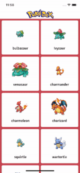

# Pokedex

Pokedex is an application that helps you find all you want to know about your favourite pokemons.

# Project structure

The project can be divided in these main parts:

* Network module, who has the aim to manage the network communication

* Models, which are structs for modelling response from api

* Utils, which contains:
    * Protocols and Definitions, used inside the projects
    * Extensions

* Sections, one for each page of the application, which are:
    * PokeList
    * PokeDetail

# Network 

Network communication is managed by the NetworkContext struct, that basically uses URLSession to perform dataTask requestes to the backend and return the result to the callers.

It requests a configuration for the initialization for useful configuration parameter, such as the baseUrl for the initial request. 

The response is managed using the Result DataType, passed to the caller using a completion block parameter. The completion block is always dispatched (using a dispatcher injected) in the MainQueue.

I decided to use protocols to handle URLSession and the MainQueue dispatching using a protocol because it is useful for testing purpose.

# Models

Models are implemented using structs and Codable. 

I decided to not using custom coding values because I thought it wasn't necessary, even if the nomenclature used for fields returned by the APIs is not the one I use inside my code 😅.

# Sections

Each section is divided in the following parts:

* ViewController: basically aims as a view of the MVVM architecture, so it instantiate layout using autolayout and is responsive to the UIKit events (for example listening to datasources and delegate methods of UICollectionView). In viewDidLoad function, each viewcontroller is subscribed to his own view model events. The subscription is performed assigning 2 functions to viewModel, one for each possible state.

* ViewModel: is the core of the business logic of the application, it doesn't know anything of the UI part (and also of uikit, of course).

* Views: sometimes in order to avoid to have massive and big view controllers, I decided to create some useful view. Since the architecture is an MVVM one, for each view with logic there is also a viewModel associated.

# Libraries management

I decided to not use any library in this project. I think that the usage of libraries must be limited to the very necessary cases.

The main reason is that every library integrated needs to be manainted in the future and can become a dependency in tecnical choises (for example in deciding to support the latest XCode, if the library we are using does not support it).

There are also other reasons:
* We don't have any control on the updates of the library
* They may increase the size of our application
* sometimes, if the code is closed, we don't know actually what the libraries do.

# Tests

The code described above is covered by Unit tests. 
I decided to cover the following sections:
* NetworkContext
* ViewModels

The motivation is that these are the main holders of the business logic of the application. Of course, in the future, some UI test with stub network can be implemented, to cover the ui part 😊.

I created a TestAppDelegate, too, to avoid to start the application using unit tests.